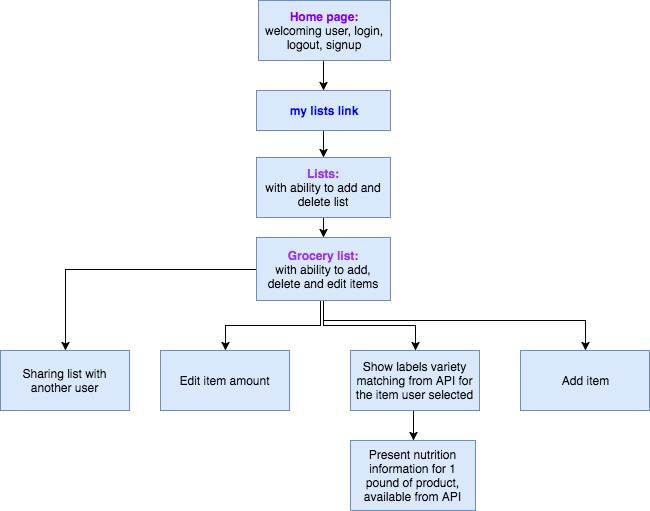
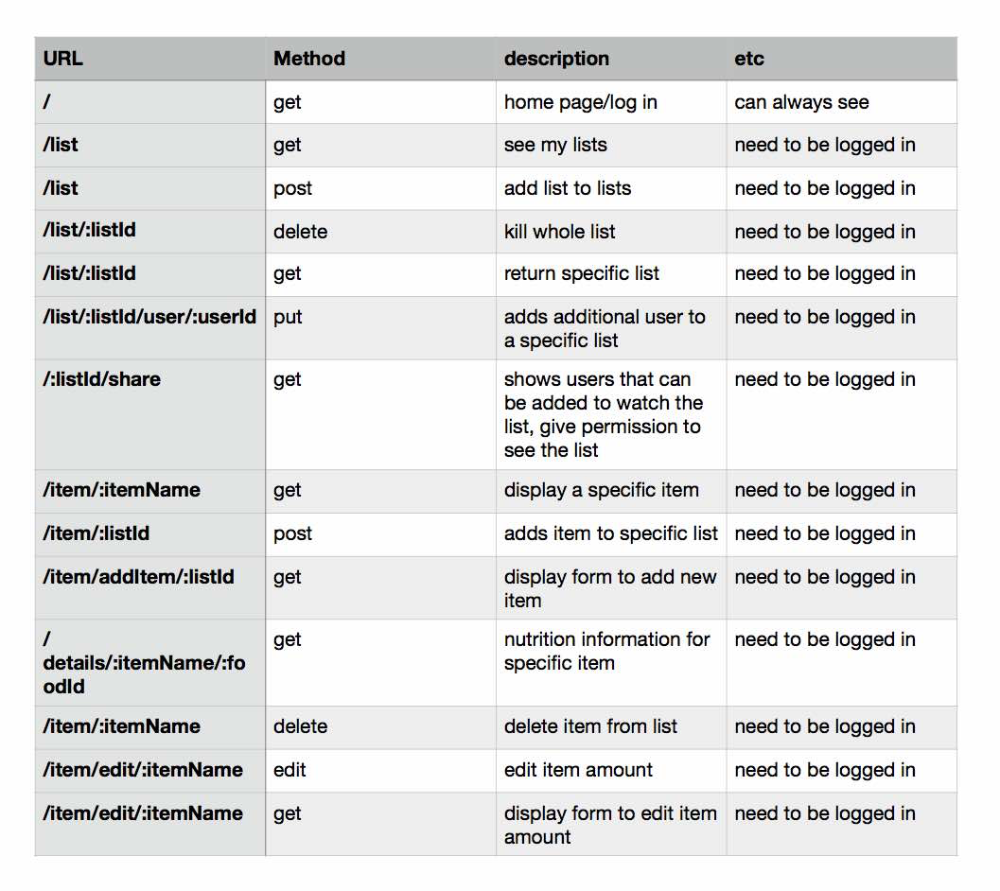

# project2-groceryapp
### WDI grocery-app

# Technologies used #

* HTML/EJS
* CSS
* vanilla JavaScript
* DOM
* JSON
* AJAX
* APINutrition API- provided by Edamam
* jQuery
* Bootstrap
* Node.js
* npm
* RESTful
* Sequelize
* Auth

# Installation instructions #
* Run `npm install` to install dependencies
* Use `nodemon` to start your application

* View this project on <a href="https://grocery-app-eo.herokuapp.com/">Heroku</a>

# Approach taken: #

_Planning:_
## User Stories ##

* As a user, I want to be able to have multiple grocery lists for different stores.
* As a user, I want to be able to delete specific grocery list.
* As a user, I want to share specific grocery list with another registered user.
* As a user, I want to add multiple items to a specific grocery list.
* As a user, I want to view a list of items I've assigned for specific grocery list, edit amount of specific item and delete specific item from the list.
* As a user, I want to see nutrition values for specific item I added to the list.

_Pseudo coding:_
_planing the flow of the app:_

_planing the routes:_

_Execution:_ 

1.     I have started with the items addition to one list, delete from list and editing amount.

2.     I have connected the nutrition API based on item name to my item.

3.     I have created the lists and connected the items to list.

4.     List can have many users and users can have many lists.

5.     Added function for possibility to share specific list with another signup user.

6.     Edited my ejs and CSS for better presentation on the screen using bootstrap.

# Unsolved problems #
_Things I would love to accomplish later:_
* Adding favorites lists and items
* Use different API for nutrition values
* change styling
